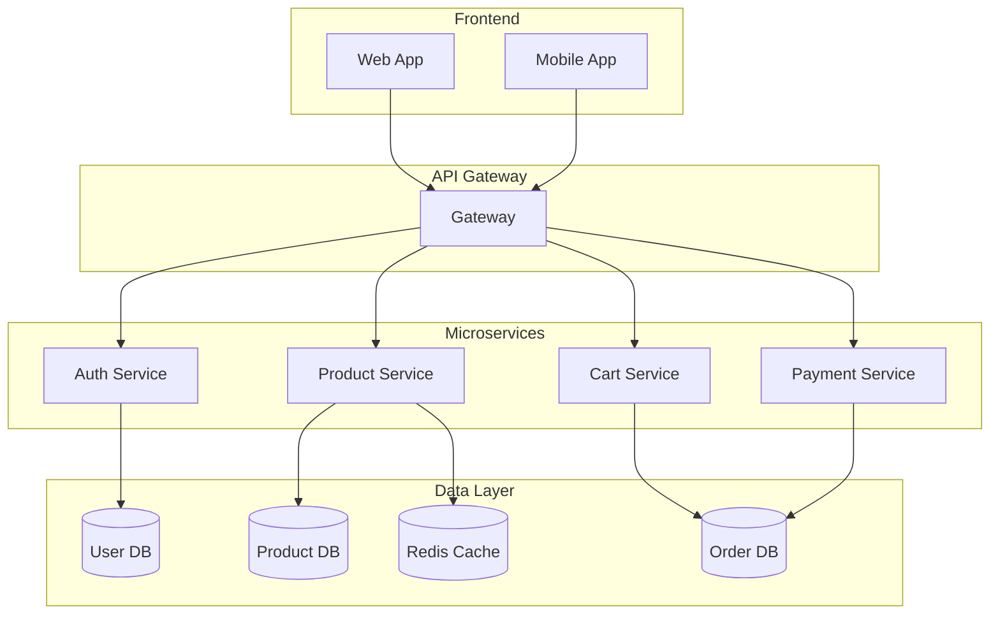
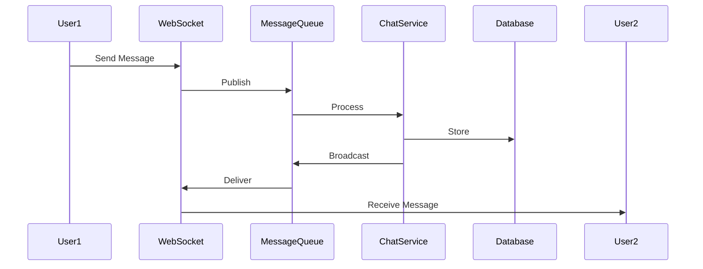
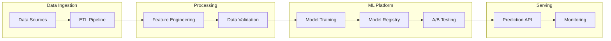
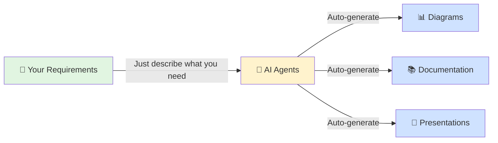
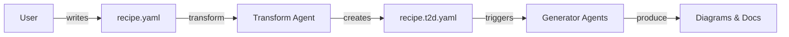

# t2d-kit: Multi-Framework Diagram Pipeline

Transform requirements into beautiful diagrams and documentation using self-organizing AI agents.

[](https://www.python.org)
[](LICENSE)
[](https://claude.ai/code)

## ✨ See it in Action

### From Simple Requirements to Professional Documentation

<table>
<tr>
<td width="50%">

**Example 1: E-Commerce Platform** 📛

```yaml
"Build an e-commerce platform with
user authentication, product catalog,
shopping cart, and payment processing.
Include microservices architecture."
```

</td>
<td width="50%">

**Generated Artifacts** ✅

```
📁 output/
├── 📊 diagrams/
│   ├── system-architecture.svg
│   ├── user-journey.svg
│   ├── database-erd.svg
│   ├── payment-sequence.svg
│   └── deployment.svg
├── 📚 documentation/
│   ├── api-reference.md
│   ├── architecture-guide.md
│   └── deployment-guide.md
└── 🎯 presentation/
    └── technical-overview.html
```

<details>
<summary>🖼️ Preview Architecture Diagram</summary>



</details>

</td>
</tr>

<tr>
<td width="50%">

**Example 2: Real-Time Chat System** 💬

```yaml
"Design a real-time chat application
with WebSocket support, message history,
group chats, and end-to-end encryption.
Focus on scalability and performance."
```

</td>
<td width="50%">

**Generated Artifacts** ✅

```
📁 output/
├── 📊 diagrams/
│   ├── websocket-flow.svg
│   ├── encryption-sequence.svg
│   ├── scalability-architecture.svg
│   ├── message-state-machine.svg
│   └── data-model.svg
├── 📚 documentation/
│   ├── websocket-protocol.md
│   ├── encryption-spec.md
│   └── scaling-guide.md
└── 🎯 presentation/
    └── system-design.html
```

<details>
<summary>🖼️ Preview Message Flow</summary>



</details>

</td>
</tr>

<tr>
<td width="50%">

**Example 3: AI Data Pipeline** 🤖

```yaml
"Create a machine learning pipeline for
processing customer data, training models,
and serving predictions via REST API.
Include monitoring and A/B testing."
```

</td>
<td width="50%">

**Generated Artifacts** ✅

```
📁 output/
├── 📊 diagrams/
│   ├── ml-pipeline.svg
│   ├── data-flow.svg
│   ├── model-lifecycle.svg
│   ├── api-architecture.svg
│   └── monitoring-dashboard.svg
├── 📚 documentation/
│   ├── pipeline-spec.md
│   ├── model-registry.md
│   └── api-documentation.md
└── 🎯 presentation/
    └── ml-platform-overview.html
```

<details>
<summary>🖼️ Preview ML Pipeline</summary>



</details>

</td>
</tr>
</table>

### 🎯 How It Works

<div align="center">



</div>

### 🚀 Start in 30 Seconds

```bash
# 1. Install uv if you don't have it (optional)
curl -LsSf https://astral.sh/uv/install.sh | sh

# 2. Install t2d-kit with uv
uv tool install git+https://github.com/afterthought/t2d-kit.git

# 3. Set up agents
t2d setup

# 4. Create your recipe and let AI do the rest!
```

---

## 🚀 Quick Start

```bash
# Install uv if you don't have it (optional)
curl -LsSf https://astral.sh/uv/install.sh | sh

# Install t2d-kit with uv
uv tool install git+https://github.com/afterthought/t2d-kit.git

# Setup agents
t2d setup

# Verify installation
t2d verify
```

## 📖 What is t2d-kit?

t2d-kit is an intelligent documentation generator that transforms Product Requirements Documents (PRDs) into comprehensive diagrams and documentation. Using self-organizing Claude Code agents, it automatically:

- 📊 **Generates Diagrams**: Architecture (C4), sequence, ERD, state, deployment diagrams
- 📝 **Creates Documentation**: Technical docs, API references, user guides
- 🎯 **Builds Presentations**: Professional slides with embedded diagrams
- 🤖 **Self-Organizes**: Agents coordinate autonomously without complex orchestration

## ✨ Features

### 🧠 Intelligent Agent Architecture
- **Transform Agent**: Converts simple recipes to detailed specifications
- **Diagram Generators**: D2, Mermaid, PlantUML agents for different diagram types
- **Content Generators**: Documentation and presentation agents
- **Natural Language**: Just tell Claude what you want

### 📐 Multiple Diagram Frameworks
- **D2**: Modern diagrams with excellent layout algorithms
- **Mermaid**: Web-ready diagrams with broad compatibility
- **PlantUML**: Formal UML diagrams for enterprise use

### 📚 Rich Output Formats
- **MkDocs**: Material-themed documentation sites
- **Marp**: Professional presentations with speaker notes
- **Multiple Formats**: SVG, PNG, PDF exports

## 🛠 Installation

### Using uv (Recommended)

```bash
# Install uv if you don't have it (optional)
curl -LsSf https://astral.sh/uv/install.sh | sh

# Install t2d-kit as a tool
uv tool install git+https://github.com/afterthought/t2d-kit.git

# Upgrade to latest version
uv tool upgrade t2d-kit

# Uninstall
uv tool uninstall t2d-kit
```

### For Development

```bash
# Clone and install in development mode
git clone https://github.com/afterthought/t2d-kit.git
cd t2d-kit
uv pip install -e .[dev]
```

### Prerequisites

```bash
# Install mise for dependency management (for diagram tools)
curl https://mise.run | sh

# Install diagram tools
mise install
```


## 📄 Usage

### 1. Create a Recipe

```yaml
# recipe.yaml
recipe:
  name: "My System"
  prd:
    content: |
      We're building an e-commerce platform that allows users to browse products,
      add them to cart, and complete purchases with multiple payment options...

  instructions:
    diagrams:
      - type: "architecture"
        description: "High-level system architecture"
      - type: "database"
        description: "Entity relationships"

    documentation:
      style: "technical"
      audience: "developers"
```

### 2. Transform and Generate

```bash
# In Claude Desktop
"Transform my recipe.yaml file"
# Agents automatically create recipe.t2d.yaml

"Generate all diagrams and documentation"
# Agents create diagrams, docs, and presentations
```

### 3. View Results

```
output/
├── diagrams/
│   ├── architecture.svg
│   └── database.svg
├── docs/
│   ├── architecture.md
│   └── api.md
└── presentation/
    └── slides.html
```

## 🤝 How It Works



1. **Write Recipe**: Express requirements in simple YAML
2. **Transform**: Agent analyzes PRD and generates specifications
3. **Generate**: Diagram and content agents create assets
4. **Integrate**: Output integrates with existing documentation

## 📁 Project Structure

```
t2d-kit/
├── src/t2d_kit/
│   ├── models/        # Pydantic data models
│   ├── cli/           # CLI commands
│   └── agents/        # Claude Code agents
├── examples/          # Recipe examples
├── docs/              # Documentation
└── tests/             # Test suite
```

## 🧪 Development

```bash
# Run tests
pytest tests/

# Format code
mise run format

# Lint code
mise run lint

# Run with coverage
mise run test-cov
```

## 📚 Documentation

- [Quickstart Guide](docs/quickstart.md)
- [API Documentation](docs/api.md)
- [Agent Usage Guide](docs/agents.md)
- [Examples](examples/)

## 🤖 Agent Commands

Agents self-activate based on context, but you can also invoke them directly:

- `/t2d-transform recipe.yaml` - Transform user recipe
- `Generate D2 diagrams` - Activates D2 generator
- `Create documentation` - Activates docs generator
- `Build presentation` - Activates slides generator

## 🔧 Configuration

### MkDocs Integration

t2d-kit generates pages that integrate with existing MkDocs sites:

```python
mkdocs_config = MkDocsPageConfig(
    output_dir=Path("existing-site/docs"),
    pages_subdir=Path("generated"),
    nav_parent="API Documentation",
    use_admonitions=True,
    use_content_tabs=True
)
```

### Diagram Options

```python
d2_options = D2Options(
    layout_engine="elk",
    theme="cool-classics",
    sketch=True
)
```

## 🚦 Performance

- Recipe validation: < 200ms
- Diagram generation: < 5s per diagram
- Supports 10+ diagrams per recipe
- Parallel processing for efficiency

## 📄 License

MIT License - see [LICENSE](LICENSE) file for details.

## 🤝 Contributing

Contributions are welcome! Please read our [Contributing Guide](CONTRIBUTING.md) for details.

## 🙏 Acknowledgments

- Built with [Claude Code](https://claude.ai/code)
- Diagrams by [D2](https://d2lang.com), [Mermaid](https://mermaid.js.org), [PlantUML](https://plantuml.com)

---

**Made with ❤️ by the t2d-kit team**