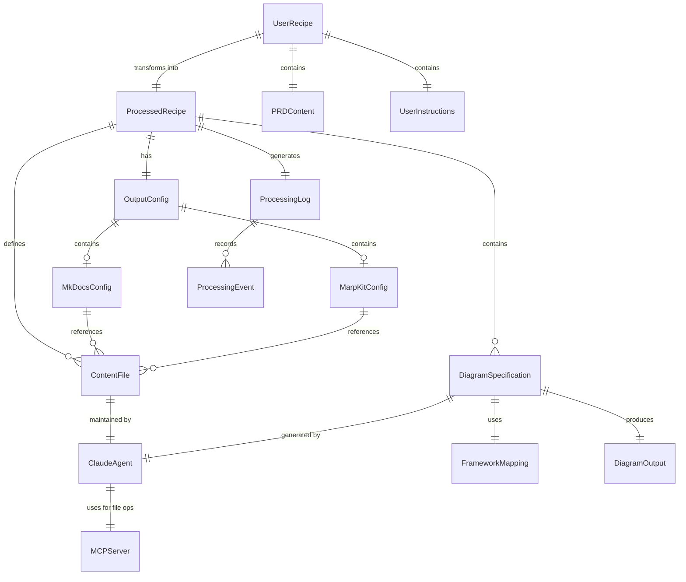

# Data Model: Multi-Framework Diagram Pipeline

**Date**: 2025-01-16
**Feature**: Multi-Framework Diagram Pipeline
**Branch**: 001-i-want-to

## Entity Relationship Diagram



## Core Entities

### UserRecipe (recipe.yaml)
**Purpose**: User-maintained recipe with PRD content and high-level instructions
**Source**: User-created YAML file
**Output**: Processed by Claude agent to generate ProcessedRecipe

| Field | Type | Required | Validation | Description |
|-------|------|----------|------------|-------------|
| name | string | Yes | Max 255 chars | Project/system name |
| version | string | No | Semantic version | Recipe version (default: 1.0.0) |
| prd | PRDContent | Yes | Valid PRD | Product requirements document |
| instructions | UserInstructions | Yes | Valid instructions | What to generate from PRD |
| preferences | Preferences | No | Valid prefs | User preferences for generation |
| metadata | Dict[str, Any] | No | JSON object | User-defined metadata |

### PRDContent
**Purpose**: Product Requirements Document content or reference
**Source**: Embedded in recipe.yaml or external file reference

| Field | Type | Required | Validation | Description |
|-------|------|----------|------------|-------------|
| content | string | Conditional | Max 1MB | Embedded PRD content |
| file_path | string | Conditional | Valid path | Path to PRD file |
| format | PRDFormat | No | Enum | Format of PRD (markdown, text, html) |
| sections | List[string] | No | Section names | Key sections to focus on |

**Validation**: Must have either `content` OR `file_path`, not both

### UserInstructions
**Purpose**: High-level instructions for what to generate
**Source**: User-defined in recipe.yaml

| Field | Type | Required | Validation | Description |
|-------|------|----------|------------|-------------|
| diagrams | List[DiagramRequest] | Yes | Min 1 item | Requested diagram types |
| documentation | DocumentationInstructions | No | Valid config | Documentation generation guidance |
| presentation | PresentationInstructions | No | Valid config | Presentation generation guidance |
| focus_areas | List[string] | No | String list | PRD sections/features to emphasize |
| exclude | List[string] | No | String list | PRD sections/features to omit |

### DiagramRequest
**Purpose**: User's high-level diagram request
**Source**: User-defined, interpreted by agent

| Field | Type | Required | Validation | Description |
|-------|------|----------|------------|-------------|
| type | string | Yes | Free text | "architecture", "user flow", etc. |
| description | string | No | Max 500 chars | What should be shown |
| framework_preference | string | No | Framework hint | Preferred framework if any |

### DocumentationInstructions
**Purpose**: Guidance for markdown content generation
**Source**: User-defined, passed to content agents as prompts
**Usage**: Transform agent converts to specific prompts for markdown_maintainer and mkdocs_formatter

| Field | Type | Required | Validation | Description |
|-------|------|----------|------------|-------------|
| style | DocStyle | No | Enum | Writing style (technical, business, tutorial) |
| audience | string | No | Max 255 chars | Target audience (developers, stakeholders, etc.) |
| sections | List[string] | No | Section names | Requested sections (overview, api, deployment, etc.) |
| detail_level | DetailLevel | No | Enum | Level of detail (high-level, detailed, comprehensive) |
| include_code_examples | bool | No | Boolean | Whether to include code samples |
| include_diagrams_inline | bool | No | Boolean | Embed diagrams vs. link to them |

**Enums**:
```python
class DocStyle(Enum):
    TECHNICAL = "technical"      # Developer-focused, technical details
    BUSINESS = "business"        # Business-focused, less technical
    TUTORIAL = "tutorial"        # Step-by-step guide format
    REFERENCE = "reference"      # API/reference documentation

class DetailLevel(Enum):
    HIGH_LEVEL = "high-level"    # Executive summary level
    DETAILED = "detailed"        # Standard documentation
    COMPREHENSIVE = "comprehensive"  # Include all details
```

### PresentationInstructions
**Purpose**: Guidance for slide generation
**Source**: User-defined, passed to marp_slides agent as prompts
**Usage**: Transform agent converts to specific prompts for slide creation

| Field | Type | Required | Validation | Description |
|-------|------|----------|------------|-------------|
| audience | string | No | Max 255 chars | Target audience for presentation |
| max_slides | int | No | 5-100 | Maximum number of slides |
| style | PresentationStyle | No | Enum | Presentation style |
| include_speaker_notes | bool | No | Boolean | Generate speaker notes |
| emphasis_points | List[string] | No | String list | Key points to emphasize |
| time_limit | int | No | Minutes | Target presentation duration |

**Enums**:
```python
class PresentationStyle(Enum):
    EXECUTIVE = "executive"      # High-level for executives
    TECHNICAL = "technical"      # Technical deep-dive
    SALES = "sales"             # Sales/marketing focus
    WORKSHOP = "workshop"        # Interactive workshop format
```

### ProcessedRecipe (recipe.t2d.yaml)
**Purpose**: Agent-generated recipe with detailed specifications
**Source**: Generated by Claude agent from UserRecipe
**Usage**: Used by orchestrator for actual generation

| Field | Type | Required | Validation | Description |
|-------|------|----------|------------|-------------|
| name | string | Yes | From UserRecipe | Project name |
| version | string | Yes | Semantic version | Recipe version |
| source_recipe | string | Yes | File path | Path to original recipe.yaml |
| generated_at | datetime | Yes | ISO 8601 | When generated |
| content_files | List[ContentFile] | Yes | Valid paths | Generated content specifications |
| diagram_specs | List[DiagramSpecification] | Yes | Min 1 item | Detailed diagram specifications |
| outputs | OutputConfig | Yes | Valid config | Output configuration |
| generation_notes | List[string] | No | String list | Notes from agent about decisions |

**State Transitions**:
- UserRecipe → (Agent Processing) → ProcessedRecipe
- ProcessedRecipe → Validated → Processing → Completed
- ProcessedRecipe → Validated → Processing → Failed

### ContentFile
**Purpose**: Markdown files maintained by Claude Code agents
**Source**: Created/maintained by Claude Code subagents

| Field | Type | Required | Validation | Description |
|-------|------|----------|------------|-------------|
| id | string | Yes | UUID or slug | Unique identifier |
| path | string | Yes | Valid path | Path to markdown file |
| type | ContentType | Yes | Enum | Type of content (documentation, presentation) |
| agent | string | Yes | Agent name | Claude agent responsible (markdown_maintainer, mkdocs_formatter, marp_slides) |
| agent_prompt | string | Yes | Max 5KB | Complete prompt including instructions and diagram context |
| diagram_context | List[DiagramReference] | Yes | Diagram info | Diagrams available for this content |
| title | string | No | Max 255 chars | Content title |
| last_updated | datetime | Yes | ISO 8601 | Last update timestamp |

### DiagramReference
**Purpose**: Information about diagrams passed to content agents
**Source**: Generated from DiagramSpecification after diagrams are created

| Field | Type | Required | Validation | Description |
|-------|------|----------|------------|-------------|
| id | string | Yes | Diagram ID | References DiagramSpecification.id |
| title | string | Yes | Max 255 chars | Diagram title |
| type | DiagramType | Yes | Enum | Type of diagram (c4_container, sequence, etc.) |
| file_path | string | Yes | Valid path | Path to generated diagram file |
| description | string | No | Max 500 chars | What the diagram shows |

**Enums**:
```python
class ContentType(Enum):
    DOCUMENTATION = "documentation"
    PRESENTATION = "presentation"
```

### DiagramSpecification
**Purpose**: Individual diagram definition with generator agent prompt
**Source**: Generated by transform agent from user's diagram requests

| Field | Type | Required | Validation | Description |
|-------|------|----------|------------|-------------|
| id | string | Yes | UUID or slug | Unique identifier |
| type | DiagramType | Yes | Enum value | Diagram type (c4, sequence, erd, etc.) |
| framework | FrameworkType | No | Enum value | Target framework (auto-selected if empty) |
| title | string | Yes | Max 255 chars | Diagram title |
| instructions | string | Yes | Max 5KB | Prompt for generator agent describing what to create |
| output_file | string | Yes | Valid path | Where to save the .d2/.mmd/.puml file |
| output_formats | List[OutputFormat] | Yes | Min 1 | Desired outputs (svg, png, pdf) |
| options | Dict[str, Any] | No | Framework-specific | Rendering options |

**Note**: The `instructions` field contains natural language prompts that tell the generator agent what diagram to create, NOT the actual D2/Mermaid/PlantUML syntax. The generator agents (t2d-d2-generator, t2d-mermaid-generator, etc.) interpret these prompts and generate the appropriate syntax.

**Enums**:
```python
class DiagramType(Enum):
    C4_CONTEXT = "c4_context"
    C4_CONTAINER = "c4_container"
    C4_COMPONENT = "c4_component"
    SEQUENCE = "sequence"
    FLOWCHART = "flowchart"
    ERD = "erd"
    GANTT = "gantt"
    STATE = "state"
    NETWORK = "network"
    ARCHITECTURE = "architecture"
    CLASS = "class"
    CUSTOM = "custom"

class FrameworkType(Enum):
    D2 = "d2"
    MERMAID = "mermaid"
    PLANTUML = "plantuml"
    GRAPHVIZ = "graphviz"
    AUTO = "auto"

class OutputFormat(Enum):
    SVG = "svg"
    PNG = "png"
    PDF = "pdf"
    INLINE = "inline"
```

### FrameworkMapping
**Purpose**: Rules for routing diagram types to frameworks
**Source**: Configuration file + runtime overrides

| Field | Type | Required | Validation | Description |
|-------|------|----------|------------|-------------|
| diagram_type | DiagramType | Yes | Enum value | Type of diagram |
| primary_framework | FrameworkType | Yes | Enum value | Preferred framework |
| fallback_framework | FrameworkType | No | Enum value | Fallback if primary unavailable |
| compatibility_score | float | Yes | 0.0-1.0 | How well framework handles type |
| features_supported | List[str] | Yes | Feature list | Supported diagram features |

**Default Mappings**:
- C4_* → D2 (fallback: PlantUML)
- SEQUENCE → Mermaid (fallback: PlantUML)
- ERD → Mermaid (no fallback)
- GANTT → Mermaid (no fallback)
- ARCHITECTURE → D2 (fallback: Graphviz)
- FLOWCHART → Mermaid (fallback: Graphviz)
- STATE → Mermaid (fallback: PlantUML)
- NETWORK → D2 (fallback: Graphviz)

### DiagramOutput
**Purpose**: Generated diagram artifact
**Source**: Framework generator output

| Field | Type | Required | Validation | Description |
|-------|------|----------|------------|-------------|
| diagram_id | string | Yes | References DiagramSpec.id | Source diagram |
| source_file | string | Yes | Valid file path | Generated source (.d2, .mmd) |
| rendered_files | Dict[OutputFormat, str] | Yes | Min 1 entry | Format → file path mapping |
| generation_time | datetime | Yes | ISO 8601 | When generated |
| framework_version | string | Yes | Version string | Framework version used |
| warnings | List[str] | No | String list | Generation warnings |
| metadata | Dict[str, Any] | No | JSON object | Framework-specific metadata |

### OutputConfig
**Purpose**: Configuration for output generation referencing markdown files
**Source**: Recipe outputs section

| Field | Type | Required | Validation | Description |
|-------|------|----------|------------|-------------|
| assets_dir | string | Yes | Valid path | Asset output directory for diagrams |
| mkdocs | MkDocsConfig | No | Valid config | MkDocs site configuration |
| marpkit | MarpKitConfig | No | Valid config | MarpKit presentation configuration |

### MkDocsConfig
**Purpose**: MkDocs-specific configuration with markdown file references
**Source**: Recipe mkdocs section

| Field | Type | Required | Validation | Description |
|-------|------|----------|------------|-------------|
| config_file | string | Yes | Valid path | Path to mkdocs.yml |
| nav_structure | List[NavItem] | Yes | Navigation tree | Site navigation referencing markdown files |
| content_refs | List[string] | Yes | File paths | References to markdown content files |
| theme | string | No | Theme name | MkDocs theme (material, readthedocs, etc.) |
| plugins | List[string] | No | Plugin list | MkDocs plugins to enable |

### MarpKitConfig
**Purpose**: MarpKit-specific configuration with markdown file references
**Source**: Recipe marpkit section

| Field | Type | Required | Validation | Description |
|-------|------|----------|------------|-------------|
| slide_files | List[string] | Yes | File paths | References to markdown slide files |
| theme | string | No | Theme name | MarpKit theme (default, gaia, uncover) |
| paginate | bool | No | Boolean | Add page numbers |
| export_pdf | bool | No | Boolean | Export to PDF |
| export_pptx | bool | No | Boolean | Export to PowerPoint |

**Enums**:
```python
class TemplateType(Enum):
    DEFAULT = "default"
    GITHUB = "github"
    GITLAB = "gitlab"
    CONFLUENCE = "confluence"
    MKDOCS = "mkdocs"
    MARPKIT = "marpkit"
    CUSTOM = "custom"  # Requires template_path

class Platform(Enum):
    GITHUB = "github"
    GITLAB = "gitlab"
    BITBUCKET = "bitbucket"
    CONFLUENCE = "confluence"
    STATIC_SITE = "static"
    MKDOCS = "mkdocs"
    MARPKIT = "marpkit"
```

### PresentationConfig
**Purpose**: MarpKit presentation generation settings
**Source**: Recipe presentation section

| Field | Type | Required | Validation | Description |
|-------|------|----------|------------|-------------|
| output_file | string | Yes | Valid path | Presentation markdown output |
| theme | string | No | Theme name | MarpKit theme (default, gaia, uncover) |
| paginate | bool | No | Boolean | Add page numbers |
| slides | List[SlideSpec] | No | Slide list | Explicit slide definitions |
| auto_split | bool | No | Boolean | Auto-split by headers |
| export_pdf | bool | No | Boolean | Export to PDF |
| export_pptx | bool | No | Boolean | Export to PowerPoint |

### SlideSpec
**Purpose**: Individual slide configuration for presentations
**Source**: Presentation slide definitions

| Field | Type | Required | Validation | Description |
|-------|------|----------|------------|-------------|
| title | string | Yes | Max 255 chars | Slide title |
| content | string | No | Markdown | Slide content |
| diagram_ids | List[string] | No | Valid IDs | Diagrams to include |
| layout | SlideLayout | No | Enum | Slide layout style |
| speaker_notes | string | No | Markdown | Speaker notes |

**Enums**:
```python
class SlideLayout(Enum):
    TITLE = "title"
    CONTENT = "content"
    TWO_COLUMN = "two-column"
    IMAGE_FOCUS = "image-focus"
    COMPARISON = "comparison"
```

### OutputAsset
**Purpose**: Generated file tracking
**Source**: Documentation builder output

| Field | Type | Required | Validation | Description |
|-------|------|----------|------------|-------------|
| id | string | Yes | UUID | Unique asset ID |
| file_path | string | Yes | Valid path | Absolute file path |
| asset_type | AssetType | Yes | Enum value | Type of asset |
| size_bytes | int | Yes | Positive int | File size |
| checksum | string | Yes | SHA256 | File checksum |
| created_at | datetime | Yes | ISO 8601 | Creation timestamp |
| references | List[str] | No | Path list | Files referencing this asset |

**Enums**:
```python
class AssetType(Enum):
    MARKDOWN = "markdown"
    DIAGRAM_SOURCE = "diagram_source"
    SVG = "svg"
    PNG = "png"
    PDF = "pdf"
    CONFIG = "config"
    PRESENTATION = "presentation"
    SLIDE_DECK = "slide_deck"
```

### ProcessingLog
**Purpose**: Recipe execution tracking and diagnostics
**Source**: Pipeline execution

| Field | Type | Required | Validation | Description |
|-------|------|----------|------------|-------------|
| id | string | Yes | UUID | Log entry ID |
| recipe_name | string | Yes | From Recipe | Recipe being processed |
| started_at | datetime | Yes | ISO 8601 | Start timestamp |
| completed_at | datetime | No | ISO 8601 | Completion timestamp |
| status | ProcessingStatus | Yes | Enum value | Current status |
| events | List[ProcessingEvent] | Yes | Event list | Processing events |
| summary | ProcessingSummary | No | On completion | Execution summary |

### ProcessingEvent
**Purpose**: Individual processing step tracking
**Source**: Pipeline stages

| Field | Type | Required | Validation | Description |
|-------|------|----------|------------|-------------|
| timestamp | datetime | Yes | ISO 8601 | Event time |
| event_type | EventType | Yes | Enum value | Type of event |
| component | string | Yes | Component name | Source component |
| message | string | Yes | Max 1KB | Event description |
| severity | Severity | Yes | Enum value | Event severity |
| context | Dict[str, Any] | No | JSON object | Additional context |

**Enums**:
```python
class ProcessingStatus(Enum):
    PENDING = "pending"
    VALIDATING = "validating"
    ROUTING = "routing"
    GENERATING = "generating"
    RENDERING = "rendering"
    BUILDING = "building"
    COMPLETED = "completed"
    FAILED = "failed"

class EventType(Enum):
    START = "start"
    VALIDATION = "validation"
    ROUTING = "routing"
    GENERATION = "generation"
    RENDERING = "rendering"
    OUTPUT = "output"
    WARNING = "warning"
    ERROR = "error"
    COMPLETE = "complete"

class Severity(Enum):
    DEBUG = "debug"
    INFO = "info"
    WARNING = "warning"
    ERROR = "error"
    CRITICAL = "critical"
```

### ProcessingSummary
**Purpose**: Execution summary statistics
**Source**: Computed from ProcessingLog

| Field | Type | Required | Validation | Description |
|-------|------|----------|------------|-------------|
| total_diagrams | int | Yes | Non-negative | Total diagrams processed |
| successful_diagrams | int | Yes | Non-negative | Successfully generated |
| failed_diagrams | int | Yes | Non-negative | Failed generation |
| total_assets | int | Yes | Non-negative | Total files created |
| execution_time_ms | int | Yes | Positive | Total execution time |
| warnings_count | int | Yes | Non-negative | Total warnings |
| errors | List[str] | No | Error list | Error messages |

### ClaudeAgent
**Purpose**: Claude Code agents that process recipes and generate content
**Source**: Agent definitions in agents/ directory

| Field | Type | Required | Validation | Description |
|-------|------|----------|------------|-------------|
| name | string | Yes | Agent name | Agent identifier (t2d-transform, t2d-orchestrate, etc.) |
| type | AgentType | Yes | Enum | Type of agent |
| description | string | Yes | Max 500 chars | Agent purpose |
| tools | List[string] | Yes | Tool names | Available tools (Read, Write, Bash, MCP) |
| prompt_file | string | Yes | File path | Path to agent prompt markdown |

**Enums**:
```python
class AgentType(Enum):
    TRANSFORM = "transform"  # recipe.yaml → recipe.t2d.yaml
    ORCHESTRATE = "orchestrate"  # Process recipe.t2d.yaml
    GENERATOR = "generator"  # Generate diagrams (d2, mermaid, plantuml)
    CONTENT = "content"  # Maintain markdown files
```

### MCPServer
**Purpose**: MCP server that provides file operations for Claude agents
**Source**: MCP server configuration

| Field | Type | Required | Validation | Description |
|-------|------|----------|------------|-------------|
| name | string | Yes | Server name | MCP server identifier (t2d-kit) |
| working_dir | string | Yes | Valid path | Working directory for recipes |
| tools | List[MCPTool] | Yes | Tool list | Available MCP tools |
| resources | List[MCPResource] | Yes | Resource list | Recipe resources |

### MCPTool
**Purpose**: Individual MCP tool provided by server
**Source**: MCP server implementation

| Field | Type | Required | Validation | Description |
|-------|------|----------|------------|-------------|
| name | string | Yes | Tool name | Tool identifier |
| operation | FileOperation | Yes | Enum | Type of file operation |
| validation | bool | Yes | Boolean | Whether Pydantic validation is applied |

**Enums**:
```python
class FileOperation(Enum):
    READ_USER_RECIPE = "read_user_recipe"
    WRITE_PROCESSED_RECIPE = "write_processed_recipe"
    LIST_RECIPES = "list_recipes"
    VALIDATE_RECIPE = "validate_recipe"
    PREVIEW_DIAGRAM = "preview_diagram"
```

## Relationships

### UserRecipe → ProcessedRecipe (1:1)
- User recipe is transformed into processed recipe by Claude agent
- One-to-one transformation preserves intent

### ProcessedRecipe → DiagramSpecification (1:N)
- Processed recipe contains one or more diagram specifications
- Diagrams are processed in parallel where possible
- Order preserved for documentation generation

### ProcessedRecipe → ContentFile (1:N)
- Processed recipe defines content files to be created
- Each content file maintained by specific Claude agent
- Files referenced by both MkDocs and MarpKit

### ContentFile → ClaudeAgent (N:1)
- Each content file maintained by a Claude agent
- Agents: markdown_maintainer, mkdocs_formatter, marp_slides
- Agent determines content structure and formatting

### DiagramSpecification → ClaudeAgent (N:1)
- Each diagram generated by appropriate Claude agent
- Generator agents: t2d-d2-generator, t2d-mermaid-generator, t2d-plantuml-generator
- Agent uses CLI tools (d2, mmdc, plantuml) for generation

### ClaudeAgent → MCPServer (N:1)
- Transform agent uses MCP to read user recipes (recipe.yaml)
- Orchestrator uses MCP to read processed recipes (recipe.t2d.yaml)
- MCP provides YAML validation with Pydantic
- Generator and content agents use their own Write/Read tools directly
- Build steps use Bash tool to run CLI commands

### DiagramSpecification → FrameworkMapping (N:1)
- Each diagram type maps to a primary framework
- Fallback framework used if primary unavailable
- User overrides take precedence

### DiagramSpecification → DiagramOutput (1:1)
- Each specification produces one output
- Output may contain multiple file formats
- Failed generations have partial output

### DocumentationConfig → OutputAsset (1:N)
- Configuration drives asset generation
- Assets include markdown, images, configs
- All assets tracked for management

### ProcessingLog → ProcessingEvent (1:N)
- Log contains chronological event stream
- Events track pipeline progress
- Errors and warnings captured

## Instruction Transformation

### How User Instructions Become Agent Prompts

The transform agent (t2d-transform) converts high-level user instructions into specific prompts for content agents:

#### Documentation Instructions → Agent Prompts
```yaml
# User provides (in recipe.yaml):
documentation:
  style: "technical"
  audience: "developers"
  detail_level: "detailed"
  include_code_examples: true

# Transform agent generates (in recipe.t2d.yaml):
content_files:
  - agent: markdown_maintainer
    agent_prompt: |
      Create technical documentation for developers.
      Include detailed explanations with code examples.
      Style: Technical reference format

      Available diagrams to include:
      1. system-architecture (C4 Container): "E-Commerce Microservices Architecture"
         Path: docs/assets/system-architecture.svg
      2. shopping-flow (Sequence): "User Shopping Flow"
         Path: docs/assets/shopping-flow.svg
      3. database-erd (ERD): "E-Commerce Database Schema"
         Path: docs/assets/database-erd.svg

      Embed these diagrams where appropriate in the documentation.
      Use markdown image syntax: 

    diagram_context:
      - id: system-architecture
        title: "E-Commerce Microservices Architecture"
        type: c4_container
        file_path: docs/assets/system-architecture.svg
      - id: shopping-flow
        title: "User Shopping Flow"
        type: sequence
        file_path: docs/assets/shopping-flow.svg
      - id: database-erd
        title: "E-Commerce Database Schema"
        type: erd
        file_path: docs/assets/database-erd.svg
```

#### Presentation Instructions → Agent Prompts
```yaml
# User provides:
presentation:
  audience: "executives"
  max_slides: 20
  style: "executive"
  emphasis_points: ["ROI", "Timeline"]

# Transform agent generates:
content_files:
  - agent: marp_slides
    agent_prompt: |
      Create executive presentation for executives.
      Maximum 20 slides.
      Emphasize: ROI, Timeline
      Style: High-level overview, avoid technical details
```

#### Focus Areas and Exclusions
These modify all agent prompts:
- **focus_areas**: Added to prompts as "Focus on: [areas]"
- **exclude**: Added to prompts as "Avoid mentioning: [items]"

### Workflow Order and Diagram Availability

The orchestrator processes recipes in this order:

1. **Generate diagram source files** (parallel execution by generator agents)
   - Each generator agent receives the `instructions` prompt
   - Agent interprets the prompt and creates the diagram syntax
   - Agent writes the .d2/.mmd/.puml file directly using Write tool
   - Example: t2d-d2-generator writes "architecture.d2"

2. **Build diagram assets** (orchestrator or build agent runs CLI tools)
   - The orchestrator (or a dedicated build agent) uses Bash tool to run CLI commands:
     - `d2 diagram.d2 diagram.svg` for D2 files
     - `mmdc -i diagram.mmd -o diagram.svg` for Mermaid files
     - `java -jar plantuml.jar diagram.puml` for PlantUML files
   - Collects paths to all generated assets (SVG, PNG files)
   - Creates DiagramReference objects for each completed diagram

3. **Create content files** with diagram context (content agents write markdown)
   - Content agents receive prompts with paths to the built diagram assets
   - Agents write markdown files directly using Write tool
   - Markdown files reference the generated SVG/PNG files
   - Example: markdown_maintainer writes "content/overview.md"

#### Example: Complete Diagram Workflow
```
Step 1 - Generator Agent (t2d-d2-generator):
  Input:
    instructions: "Create a C4 Container diagram showing microservices..."
    output_file: "docs/assets/system.d2"

  Agent Actions:
    1. Interprets the instructions
    2. Creates D2 syntax in memory
    3. Uses Write tool: Write("docs/assets/system.d2", d2_content)

  Output:
    File written: "docs/assets/system.d2"

Step 2 - Build Step (orchestrator or build agent):
  Uses Bash tool: Bash("d2 docs/assets/system.d2 docs/assets/system.svg")

  Output:
    File created by d2 CLI: "docs/assets/system.svg"

Step 3 - Content Generation (markdown_maintainer):
  Input:
    agent_prompt: "Create documentation..."
    diagram_context: [{
      id: "system-architecture",
      file_path: "docs/assets/system.svg"
    }]

  Agent Actions:
    1. Creates markdown content
    2. Embeds diagram: 
    3. Uses Write tool: Write("content/overview.md", markdown_content)

  Output:
    File written: "content/overview.md"
```

## Validation Rules

### Recipe Validation
1. Must have at least one diagram specification
2. PRD content OR reference required (not both)
3. Documentation config must specify valid paths
4. Recipe name must be unique within batch

### DiagramSpecification Validation
1. ID must be unique within recipe
2. Framework auto-selected if not specified
3. Instructions required for generation
4. Output formats must be supported by framework

### Path Validation
1. All paths must be valid for target OS
2. Output directories created if not exist
3. No path traversal attacks (../ blocked)
4. Asset paths relative to assets_dir

### Size Constraints
1. Recipe file: Max 10MB
2. PRD content: Max 1MB
3. Instructions: Max 50KB per diagram
4. Total output: Warning at 100MB

## Indexes and Performance

### Primary Indexes
- Recipe.name (unique within batch)
- DiagramSpecification.id (unique within recipe)
- OutputAsset.file_path (unique)
- ProcessingLog.id (unique)

### Query Patterns
1. Find recipe by name → O(1)
2. Get diagrams for recipe → O(n)
3. Check framework compatibility → O(1)
4. List assets for documentation → O(n)
5. Get processing events for log → O(n)

### Caching Strategy
1. Framework mappings cached at startup
2. Templates cached after first use
3. Rendered diagrams cached for 30 days
4. Recipe validation results cached

## Migration and Versioning

### Schema Version
- Current: 1.0.0
- Version stored in recipe
- Backward compatibility for 2 major versions

### Migration Strategy
1. New fields: Add with defaults
2. Removed fields: Deprecate first
3. Type changes: Provide converters
4. Breaking changes: Major version bump

---
*Data model defined: 2025-01-16*