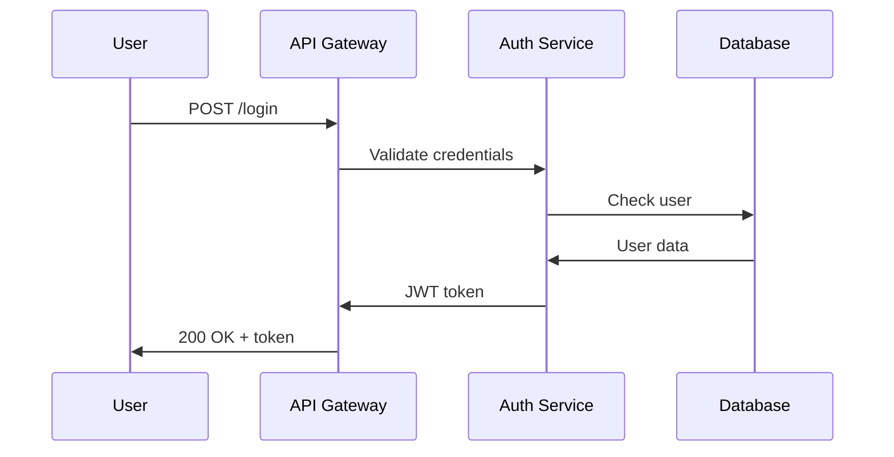
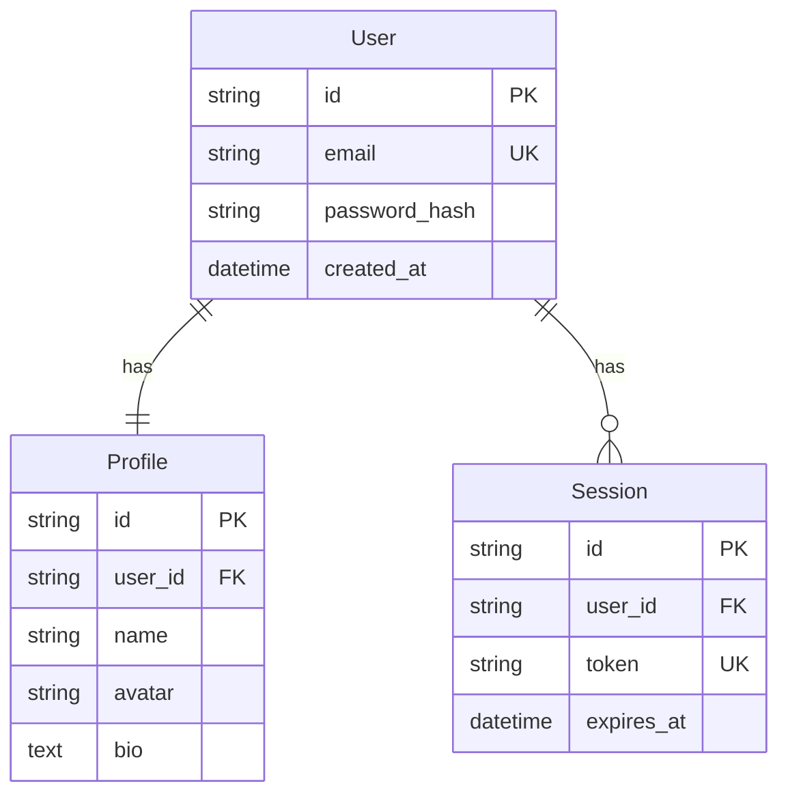

# Quickstart Guide: t2d-kit

**Multi-Framework Diagram Pipeline**
*Transform YAML recipes into beautiful documentation and presentations with auto-routed diagrams*

## Installation

### Step 1: Install and Setup
```bash
# Install with uv package manager
uvx install t2d-kit

# Setup agents and optionally create initial recipe
t2d setup              # Just setup agents
t2d setup --init       # Setup and create recipe.yaml

# Output:
# ✅ t2d-kit setup complete!
#    Claude agents installed to: ~/.claude
#
# 📝 Available commands:
#    /t2d-transform - Transform user recipe to processed recipe
#    /t2d-create    - Process recipe and generate outputs
```

### Step 2: Configure MCP Server (Optional)
```bash
# Start MCP server with current directory as working directory
t2d mcp

# Or specify a different working directory for recipes
t2d mcp ~/my-recipes

# Add to Claude Desktop MCP settings:
{
  "mcpServers": {
    "t2d-kit": {
      "command": "t2d",
      "args": ["mcp", "."]
    }
  }
}

# The MCP server provides:
# - Recipe file management (read/write/validate)
# - Recipe resources for discovery
# - Diagram preview with visual rendering
# - Tool availability checking
```

### Step 3: Verify Installation
```bash
# Check all components
t2d verify

# ✓ Claude Code found
# ✓ Agent files installed
# ✓ Slash commands available
# ✓ mise installed
# ✓ D2 available
# ✓ Mermaid CLI available
# ✓ MCP server functional
```

## Prerequisites

### Automatic Setup with mise

t2d-kit uses mise (mise-en-place) to automatically manage all tool dependencies:

```bash
# Install mise if not already present
curl https://mise.run | sh

# Clone the project and let mise handle dependencies
cd t2d-kit
mise install  # Installs all tools defined in .mise.toml

# Tools installed by mise:
# - Python 3.11+
# - Node.js 20+ (for Mermaid CLI)
# - Go 1.21+ (for D2)
# - Java 17+ (for PlantUML)
# - D2 CLI (via Go)
# - Mermaid CLI (via npm)
```

The `.mise.toml` configuration:
```toml
[tools]
python = "3.11"
node = "20"
go = "1.21"
java = "17"
"npm:@mermaid-js/mermaid-cli" = "latest"  # Installs mmdc
"go:oss.terrastruct.com/d2" = "latest"     # Installs d2

[tasks.setup-plantuml]
description = "Download PlantUML jar"
run = "curl -L https://github.com/plantuml/plantuml/releases/latest/download/plantuml.jar -o ~/.local/share/plantuml/plantuml.jar"
```

### Manual Installation (Alternative)

If you prefer manual installation:

```bash
# Install Go (for D2)
# macOS: brew install go
# Linux: sudo apt install golang-go

# Install D2
go install oss.terrastruct.com/d2@latest

# Install Node.js and Mermaid CLI
# macOS: brew install node
# Linux: sudo apt install nodejs npm
npm install -g @mermaid-js/mermaid-cli

# Optional: PlantUML (requires Java)
# macOS: brew install openjdk plantuml
# Linux: sudo apt install default-jre plantuml
```

## Development Workflow

### Simple Claude Desktop Workflow

Just tell Claude what you want in natural language:

```
# Transform and preview in one request:
"Transform recipe.yaml, process it, and show me a preview"

# Claude will:
# 1. Transform recipe.yaml → recipe.t2d.yaml
# 2. Generate all diagrams and content
# 3. Start preview servers automatically
# 4. Report URLs:
#    - Documentation: http://localhost:8000
#    - Presentation: http://localhost:8080

# Make changes and preview:
"Update the architecture diagram to show microservices and preview the changes"

# Claude will:
# 1. Update the diagram
# 2. Regenerate affected content
# 3. Preview servers auto-reload
```

The orchestrator agent handles all preview server management based on your request. No need for manual server commands!

## Quick Start Example

### 1. Create a User Recipe File

#### Option A: Interactive Creation (Recommended)
```bash
# Create recipe interactively with prompts
t2d init --interactive --name "My Project"

# Or use templates:
t2d init --name "My Project" --template full     # All features
t2d init --name "My Project" --template basic    # Common setup
t2d init --name "My Project" --template minimal  # Bare minimum
```

#### Option B: Manual Creation
Save as `recipe.yaml` (user-maintained, simple):

```yaml
recipe:
  name: "E-Commerce Platform"
  version: "1.0.0"

  # Product Requirements Document (3 options)

  # Option 1: Embedded PRD content
  prd:
    content: |
      # E-Commerce Platform PRD

      ## Overview
      We're building a modern e-commerce platform that allows users to browse products,
      add items to cart, and complete purchases with multiple payment methods.

      ## Key Features
      - User registration and authentication
      - Product catalog with search and filtering
      - Shopping cart management
      - Order processing and payment
      - Order tracking and history
      - Admin dashboard for inventory management

      ## Technical Requirements
      - RESTful API architecture
      - Microservices for scalability
      - PostgreSQL for data persistence
      - Redis for caching
      - Stripe for payment processing
      - React frontend with TypeScript

      ## User Flows
      1. Registration: Email verification required
      2. Shopping: Browse -> Add to Cart -> Checkout
      3. Payment: Multiple payment methods supported
      4. Order: Real-time tracking with notifications

  # High-level instructions for generation
  instructions:
    diagrams:
      - type: "system architecture"
        description: "Show all microservices and their interactions"

      - type: "user shopping flow"
        description: "Sequence diagram from browse to purchase"

      - type: "database schema"
        description: "ERD for products, users, and orders"

      - type: "deployment architecture"
        description: "Show Kubernetes clusters and services"

    documentation:
      style: "technical"  # Developer-focused documentation
      audience: "backend developers and DevOps engineers"
      sections:
        - "overview"
        - "architecture"
        - "api-reference"
        - "deployment-guide"
      detail_level: "detailed"
      include_code_examples: true
      include_diagrams_inline: true

    presentation:
      audience: "executive stakeholders and investors"
      max_slides: 20
      style: "executive"  # High-level overview
      include_speaker_notes: true
      emphasis_points:
        - "Scalability to 1M users"
        - "Security compliance"
        - "Time to market advantages"
      time_limit: 15  # 15-minute presentation

    focus_areas:
      - "Microservices communication patterns"
      - "Payment processing security measures"
      - "Horizontal scaling capabilities"
      - "High availability architecture"

    exclude:
      - "Internal implementation details"
      - "Third-party API keys"
      - "Database passwords"
```

### Alternative PRD Sources

#### Option 2: Local File Reference
```yaml
recipe:
  name: "E-Commerce Platform"
  prd:
    file_path: "docs/requirements/e-commerce-prd.md"
    format: markdown
    sections:  # Optional: specific sections to focus on
      - "Technical Requirements"
      - "API Specifications"
```

#### Option 3: External PRD via MCP
When you need to fetch a PRD from an external source, you can:

```bash
# Tell Claude to fetch the PRD first:
"First fetch the PRD document with UUID abc-123 using mcp__chat-prd__get_document,
then transform recipe.yaml using that PRD"

# Or provide instructions with the transform command:
"Transform recipe.yaml, but first fetch the PRD from document UUID abc-123"
```

The transform agent will:
1. Fetch the PRD using the appropriate MCP tool
2. Use the fetched content as the PRD
3. Continue with normal recipe transformation

### 2. Transform Recipe (Agent Processing)

Transform the user recipe into a detailed specification by asking Claude Desktop:

```
# In Claude Desktop, simply ask:
"Use the t2d-transform agent to transform recipe.yaml"

# Or use the slash command:
/t2d-transform recipe.yaml

# Claude Desktop will use Desktop Commander to execute the transform agent
# which analyzes the PRD and generates recipe.t2d.yaml
```

This generates `recipe.t2d.yaml` (agent-generated, detailed):

```yaml
recipe:
  name: "E-Commerce Platform"
  version: "1.0.0"
  source_recipe: "recipe.yaml"
  generated_at: "2025-01-17T10:30:00Z"

  # Agent-generated content specifications with prompts
  content_files:
    - id: overview
      path: content/overview.md
      type: documentation
      agent: markdown_maintainer
      agent_prompt: |
        Create technical documentation for backend developers and DevOps engineers.
        Include code examples and embed diagrams inline.
        Focus on: Microservices communication patterns, Payment processing security measures
        Style: Detailed technical documentation

        Available diagrams:
        - system-architecture: "E-Commerce Microservices Architecture" (docs/assets/system-architecture.svg)
        - shopping-flow: "User Shopping Flow" (docs/assets/shopping-flow.svg)
        - database-erd: "E-Commerce Database Schema" (docs/assets/database-erd.svg)
        - deployment-architecture: "Kubernetes Deployment" (docs/assets/deployment-architecture.svg)

        Embed relevant diagrams using: 

    - id: architecture
      path: content/architecture.md
      type: documentation
      agent: mkdocs_formatter
      agent_prompt: |
        Format architecture documentation for MkDocs.
        Target audience: backend developers and DevOps engineers
        Include detailed technical information with code examples.
        Focus on: Horizontal scaling capabilities, High availability architecture

    - id: api-docs
      path: content/api-docs.md
      type: documentation
      agent: markdown_maintainer
      agent_prompt: |
        Generate API reference documentation.
        Style: Technical reference format
        Include code examples for each endpoint
        Detail level: Detailed

    - id: slides
      path: content/slides.md
      type: presentation
      agent: marp_slides
      agent_prompt: |
        Create executive presentation for stakeholders and investors.
        Maximum 20 slides, 15-minute presentation.
        Include speaker notes.
        Emphasize: Scalability to 1M users, Security compliance, Time to market advantages
        Style: Executive summary level, avoid technical jargon

  # Agent-generated detailed diagram specs with prompts
  diagram_specs:
    - id: system-architecture
      type: c4_container
      framework: d2  # Auto-selected by transform agent
      title: "E-Commerce Microservices Architecture"
      output_file: "docs/assets/system-architecture.d2"
      instructions: |
        Create a C4 Container diagram showing the e-commerce platform architecture.
        Based on the PRD, include:
        - User-facing applications (Web and Mobile)
        - API Gateway as the central entry point
        - Microservices: Auth Service, Product Service, Cart Service, Order Service, Payment Service, Notification Service
        - Data stores: PostgreSQL for persistent data, Redis for caching
        - External integration: Stripe API for payments
        - Show all connections with appropriate protocols (HTTPS, gRPC, SQL, AMQP)
        - Use proper C4 notation with clear labels

    - id: shopping-flow
      type: sequence
      framework: mermaid  # Auto-selected by transform agent
      title: "User Shopping Flow"
      output_file: "docs/assets/shopping-flow.mmd"
      instructions: |
        Create a sequence diagram showing the complete user shopping flow.
        Based on the PRD, show the flow from browse to purchase:
        1. User browsing products (interaction with Product Service)
        2. Adding items to cart (Cart Service with Redis)
        3. Proceeding to checkout
        4. Payment processing (Payment Service with Stripe)
        5. Order confirmation (Order Service)
        6. Notification sending (Notification Service)
        Show all API calls, service interactions, and data operations.
        Include error handling paths for payment failures.

    - id: database-erd
      type: erd
      framework: mermaid  # Auto-selected by transform agent
      title: "E-Commerce Database Schema"
      output_file: "docs/assets/database-erd.mmd"
      instructions: |
        Create an Entity Relationship Diagram for the e-commerce database.
        Based on the PRD, include these entities and relationships:
        - Users (with email, password_hash, timestamps)
        - Profiles (user profiles with name, avatar, bio)
        - Products (with name, description, price, stock)
        - Categories (for organizing products)
        - Orders (with user reference, status, total, timestamps)
        - OrderItems (linking orders to products with quantity and price)
        - Payments (payment records with method, amount, status)
        - Sessions (for user authentication tokens)
        Show all primary keys, foreign keys, and cardinality of relationships.
        Use standard ERD notation with proper relationship labels.

    - id: deployment-architecture
      type: architecture
      framework: d2  # Auto-selected by transform agent
      title: "Kubernetes Deployment"
      output_file: "docs/assets/deployment-architecture.d2"
      instructions: |
        Create a deployment architecture diagram showing the Kubernetes setup.
        Based on the PRD requirements for scalability and high availability:
        - Show multiple Kubernetes clusters (production and staging)
        - Include node pools with auto-scaling capabilities
        - Show ingress controllers and load balancers
        - Depict microservice deployments with replica sets
        - Include persistent volume claims for databases
        - Show ConfigMaps and Secrets management
        - Include monitoring stack (Prometheus, Grafana)
        - Show CI/CD pipeline integration points
        Emphasize horizontal scaling and high availability features.

  outputs:
    assets_dir: docs/assets

    mkdocs:
      config_file: mkdocs.yml
      content_refs:
        - content/overview.md
        - content/architecture.md
        - content/api-docs.md

    marpkit:
      slide_files:
        - content/slides.md
      theme: gaia
      paginate: true
      export_pdf: true

  generation_notes:
    - "Identified 4 main diagram needs from PRD analysis"
    - "Selected D2 for architecture diagrams (better for complex systems)"
    - "Selected Mermaid for sequence and ERD (better syntax for these types)"
    - "Added API documentation based on 'include_api_docs' preference"
    - "Structured content for both technical docs and stakeholder presentation"
```

### 3. Process the Generated Recipe

```
# In Claude Desktop, ask:
"Use the t2d-orchestrate agent to process recipe.t2d.yaml"

# Or use the slash command:
/t2d-create recipe.t2d.yaml

# Behind the scenes:
# 1. Claude Desktop uses Desktop Commander to execute the orchestrator
# 2. Claude orchestrator reads recipe.t2d.yaml using MCP tools
# 3. Orchestrator invokes diagram generator agents (parallel)
# 4. Generator agents write source files directly (.d2, .mmd, .puml)
# 5. Orchestrator or a build agent runs CLI tools to compile diagrams
# 6. Content maintainer agents write markdown files directly
# 7. All agents use their Write tool to save files

# Output:
# ✓ Processing recipe: E-Commerce Platform
# ✓ Source recipe: recipe.yaml
# ✓ Generated at: 2025-01-17T10:30:00Z
#
# Step 1: Diagram source generation (4 agents in parallel):
# ✓ t2d-d2-generator → system-architecture.d2
# ✓ t2d-mermaid-generator → shopping-flow.mmd
# ✓ t2d-mermaid-generator → database-erd.mmd
# ✓ t2d-d2-generator → deployment-architecture.d2
#
# Step 2: Building diagram assets:
# ✓ d2 system-architecture.d2 system-architecture.svg
# ✓ mmdc -i shopping-flow.mmd -o shopping-flow.svg
# ✓ mmdc -i database-erd.mmd -o database-erd.svg
# ✓ d2 deployment-architecture.d2 deployment-architecture.svg
#
# Step 3: Content generation (4 agents in parallel):
# ✓ content/overview.md (markdown_maintainer)
# ✓ content/architecture.md (mkdocs_formatter)
# ✓ content/api-docs.md (markdown_maintainer)
# ✓ content/slides.md (marp_slides)
#
# Final assets:
#   Source files:
#     - docs/assets/system-architecture.d2
#     - docs/assets/shopping-flow.mmd
#     - docs/assets/database-erd.mmd
#     - docs/assets/deployment-architecture.d2
#
#   Built diagrams:
#     - docs/assets/system-architecture.svg
#     - docs/assets/shopping-flow.svg
#     - docs/assets/database-erd.svg
#     - docs/assets/deployment-architecture.svg
#
#   Content:
#     - content/overview.md
#     - content/architecture.md
#     - content/api-docs.md
#     - content/slides.md
#
# Configurations created:
#   - mkdocs.yml
#   - marp config
```

### 3. View the Generated Files

Claude Code agents maintain markdown files that are referenced by both MkDocs and Marp:

**content/architecture.md** (maintained by Claude Code mkdocs_formatter):

```markdown
# System Architecture

## System Context


<details>
<summary>View diagram source</summary>

```d2
# C4 Context Diagram source code here...
```
</details>

## Login Flow



## User Database


```

## CLI Commands

The t2d CLI provides minimal commands for setup and MCP server management. All processing is done through Claude agents.

### Setup and Configuration
```bash
# Install agents and slash commands to ~/.claude/
t2d setup

# Start MCP server with working directory
t2d mcp .

# Verify installation
t2d verify
```

### Working with Recipes

Recipe transformation and processing is done through Claude Desktop:

```
# In Claude Desktop:

# Transform a user recipe:
"Use the t2d-transform agent to transform recipe.yaml"

# Process a recipe:
"Use the t2d-orchestrate agent to process recipe.t2d.yaml"

# Or use slash commands:
/t2d-transform recipe.yaml
/t2d-create recipe.t2d.yaml
```

### Validate Recipe

Recipe validation is done through the MCP server:

```
# In Claude Desktop with MCP server running:
"Validate the recipe.yaml file"

# Claude will use MCP tools to validate the YAML structure
# and check for required fields using Pydantic models
```

### Information Commands

```
# In Claude Desktop:

# List available recipes:
"Show me all available recipes"

# Get information about diagram types:
"What diagram types does t2d-kit support?"

# Check framework availability:
"Which diagram frameworks are available?"

# Claude will use MCP resources and tools to provide this information
```

## Python Components

The Python code in t2d-kit is minimal and focused on two areas:

### 1. CLI Wrapper (cli/main.py)
```python
# Handles setup and MCP server startup only
@click.group()
def cli():
    """t2d-kit: Multi-framework diagram pipeline."""
    pass

@cli.command()
def setup():
    """Install Claude agents and slash commands."""
    # Copies agent files to ~/.claude/agents/
    # Copies slash commands to ~/.claude/commands/

@cli.command()
@click.argument('working_dir')
def mcp(working_dir):
    """Start MCP server for recipe operations."""
    # Starts the MCP server with specified working directory
```

### 2. MCP Server (mcp/server.py)
```python
# Provides file operations for Claude agents
class RecipeMCPServer:
    async def read_user_recipe(path: str) -> UserRecipe:
        # Read and validate with Pydantic

    async def write_processed_recipe(path: str, recipe: ProcessedRecipe):
        # Validate and write with Pydantic

    async def list_recipes() -> List[RecipeResource]:
        # Return available recipes as MCP resources
```

All recipe transformation and processing logic resides in Claude agents, not Python code.

## Claude Desktop Integration

### Dual-Mode Operation

t2d-kit operates in two complementary modes:

#### 1. Interactive Mode (Claude Desktop)

Configure MCP server in Claude Desktop settings:
```json
{
  "mcpServers": {
    "t2d-kit": {
      "command": "t2d",
      "args": ["mcp", "."],
      "env": {}
    }
  }
```

Then use natural language in Claude Desktop:
```
# Create recipes:
"Create a recipe for my e-commerce platform architecture with C4 diagrams"

# Transform recipes:
"Use the t2d-transform agent to transform recipe.yaml"

# Process recipes:
"Use the t2d-orchestrate agent to process recipe.t2d.yaml"

# Claude Desktop will use Desktop Commander to execute the appropriate agents
```

#### 2. How Desktop Commander Works

Desktop Commander is the execution environment that allows Claude Desktop to run Claude CLI commands:

```
User asks Claude Desktop → "Transform recipe.yaml"
↓
Claude Desktop recognizes agent request
↓
Desktop Commander executes: claude "Use t2d-transform agent on recipe.yaml"
↓
Transform agent runs with access to MCP tools
↓
Generates recipe.t2d.yaml
```

Desktop Commander is NOT a separate CLI tool you run - it's the bridge between Claude Desktop and headless Claude execution.

### Claude Code Architecture

The entire workflow is orchestrated by Claude Code:

**commands/orchestrate.txt** (Main orchestrator):
```
You are the t2d-kit orchestrator. Given a recipe file:
1. Read and parse YAML structure using MCP file operations
2. Route each diagram to the appropriate framework based on rules below
3. Invoke diagram generator subagents (Claude Code) for creation
4. Invoke content maintainer subagents for markdown generation
5. Generate MkDocs and MarpKit configurations
6. Report progress and handle errors gracefully

ROUTING RULES - Apply these when framework not specified:
- C4 diagrams (context, container, component) → D2
- Sequence diagrams → Mermaid
- Flowcharts → Mermaid
- ERD → Mermaid
- Gantt → Mermaid (only option)
- Architecture → D2
- Network → D2
- State machines → Mermaid
- Class diagrams → PlantUML
- Allow user overrides if framework specified in recipe

Available subagents (all Claude Code):
- d2_generator: Creates D2 diagrams using d2 CLI
- mermaid_generator: Creates Mermaid diagrams using mmdc CLI
- plantuml_generator: Creates PlantUML diagrams using plantuml CLI
- markdown_maintainer: General content creation
- mkdocs_formatter: Documentation formatting
- marp_slides: Presentation slide creation

Use MCP for all file operations (read, write, parse YAML).
```

**prompts/markdown_maintainer.txt** (Content subagent):
```
You are a markdown content maintainer. Given the following context:
- Diagram assets: {diagram_paths}
- Content type: {content_type}
- Recipe context: {recipe_content}

Generate well-structured markdown documentation that embeds the diagrams appropriately.
```

**prompts/mkdocs_formatter.txt** (MkDocs subagent):
```
You are an MkDocs documentation formatter. Format the content for optimal MkDocs rendering...
```

**prompts/marp_slides.txt** (Marp subagent):
```
You are a Marp presentation creator. Transform the content into slide format...
```

## Working with t2d-kit

### Understanding the Architecture

t2d-kit is a Claude-first system where:
- All intelligence resides in Claude agents
- Python only provides minimal infrastructure (CLI setup, MCP server)
- Desktop Commander enables headless agent execution
- MCP provides file operations for agents

### Typical Workflow

1. **Write your user recipe** (recipe.yaml) with PRD content
2. **Ask Claude Desktop** to transform it: "Use the t2d-transform agent on recipe.yaml"
3. **Review the generated recipe** (recipe.t2d.yaml)
4. **Ask Claude Desktop** to process it: "Use the t2d-orchestrate agent on recipe.t2d.yaml"
5. **View generated diagrams and documentation** in the output directories

## MarpKit Presentation Generation

### Create a Presentation Recipe

Save as `presentation.yml`:

```yaml
recipe:
  name: "Architecture Presentation"
  diagram_specs:
    - id: system-overview
      type: c4_context
      title: "System Architecture"
      instructions: "Show main components and interactions"

    - id: user-flow
      type: sequence
      title: "User Journey"
      instructions: "Login -> Browse -> Purchase -> Checkout"

  documentation:
    main_file: docs/architecture.md
    assets_dir: docs/assets
    platforms:
      - marpkit
    presentation:
      output_file: slides/architecture.md
      theme: gaia
      paginate: true
      auto_split: true
      export_pdf: true
      slides:
        - title: "System Architecture"
          diagram_ids: [system-overview]
          layout: image-focus
          speaker_notes: "Explain the high-level architecture"

        - title: "User Flow"
          diagram_ids: [user-flow]
          layout: content
          speaker_notes: "Walk through the user journey"
```

### Generate Presentation

```bash
# Create presentation
t2d create presentation.yml --template marpkit

# Convert to PDF/HTML
marp slides/architecture.md --pdf
marp slides/architecture.md --html

# Serve live presentation
marp --server slides/
```

### Generated Marp Markdown

The output `slides/architecture.md` will contain:

```markdown
---
marp: true
theme: gaia
paginate: true
---

# System Architecture


<!--
Explain the high-level architecture
-->

---

# User Flow


<!--
Walk through the user journey
-->
```

## MkDocs Integration

### Setup

1. Install MkDocs with diagram plugins:
```bash
pip install mkdocs mkdocs-mermaid2-plugin
```

2. Configure `mkdocs.yml`:
```yaml
site_name: My Documentation
theme:
  name: material

plugins:
  - search
  - mermaid2:
      version: 9.4.3

markdown_extensions:
  - pymdownx.superfences:
      custom_fences:
        - name: mermaid
          class: mermaid
          format: !!python/name:pymdownx.superfences.fence_code_format

extra_javascript:
  - https://unpkg.com/mermaid@9.4.3/dist/mermaid.min.js
```

3. Generate documentation:
```bash
t2d create recipe.yml --template mkdocs
mkdocs serve
```

## Recipe Examples

### Multi-Page Documentation

```yaml
recipe:
  name: "Complete System Docs"
  diagram_specs:
    # ... diagram definitions ...

  documentation:
    main_file: docs/index.md
    assets_dir: docs/assets
    pages:
      - file: docs/architecture.md
        diagrams: [c4-context, c4-container]
      - file: docs/database.md
        diagrams: [user-erd, order-erd]
      - file: docs/workflows.md
        diagrams: [login-flow, checkout-flow]
```

### Framework Override

```yaml
diagram_specs:
  - id: custom-network
    type: network
    framework: graphviz  # Override default D2
    instructions: |
      digraph Network {
        router -> switch1
        router -> switch2
        switch1 -> server1
        switch1 -> server2
        switch2 -> server3
      }
```

## Troubleshooting

### Common Issues

**Framework not found**
```bash
# Check installed frameworks
t2d list-frameworks

# Install missing framework
npm install -g @mermaid-js/mermaid-cli  # For Mermaid
```

**Recipe validation fails**
```bash
# Get detailed validation info
t2d validate recipe.yml --verbose

# Common issues:
# - Missing required fields
# - Invalid diagram type
# - YAML syntax errors
```

**Slow generation**
```bash
# Use parallel processing for multiple diagrams
t2d create recipe.yml --parallel 4

# Cache rendered diagrams
export T2D_CACHE_DIR=~/.t2d-cache
```

### Debug Mode

```bash
# Enable debug logging
export T2D_LOG_LEVEL=DEBUG
t2d create recipe.yml

# Save debug log
t2d create recipe.yml --debug 2> debug.log
```

## Next Steps

1. **Explore Examples**: Check the `examples/` directory for more recipes
2. **Read the Docs**: Full documentation at [docs.t2d-kit.io](https://docs.t2d-kit.io)
3. **Contribute**: Submit recipes and improvements at [github.com/t2d-kit/t2d-kit](https://github.com/t2d-kit/t2d-kit)
4. **Get Support**: Join discussions at [github.com/t2d-kit/t2d-kit/discussions](https://github.com/t2d-kit/t2d-kit/discussions)

---
*Happy diagramming! 🎨*