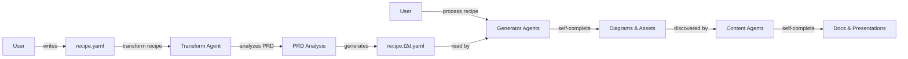

# Recipe Transformation Workflow

**Date**: 2025-01-17
**Feature**: Multi-Framework Diagram Pipeline
**Branch**: 001-i-want-to

## Overview

The t2d-kit system uses a two-file recipe approach that separates user intent from implementation details:

1. **recipe.yaml** - User-maintained, simple, high-level
2. **recipe.t2d.yaml** - Agent-generated, detailed, executable

## Workflow Stages (Simplified - No Orchestrator)



**Key Change**: No orchestrator needed! Agents are invoked naturally based on user requests and complete their work independently.

## Stage 1: User Recipe Creation

### Purpose
Users express their intent without needing to know implementation details.

### Structure
```yaml
recipe:
  name: "Project Name"
  prd:
    content: "Full PRD text..."  # OR
    file_path: "path/to/prd.md"
  instructions:
    diagrams:
      - type: "what you want"
        description: "clarification"
    documentation:
      style: "technical|business"
    presentation:
      audience: "developers|stakeholders"
```

### Key Features
- Natural language diagram requests
- PRD as primary source of truth
- High-level preferences, not specifications
- Focus areas and exclusions

## Stage 2: Agent Transformation (Claude Code)

### Trigger Methods

```bash
# Option 1: Via slash command in Claude Desktop
/t2d-transform recipe.yaml

# Option 2: Direct Claude CLI
claude "Use the t2d-transform agent to transform recipe.yaml"
```

### Important: Component Responsibilities
- **Python MCP Server**: File operations only (read/write/validate YAML)
- **Claude Code Agents**: All intelligence and processing
  - Transform agent: Analyzes PRD, generates recipe.t2d.yaml
  - Orchestrator: Processes recipe.t2d.yaml
  - Generator agents: Create diagrams using CLI tools
  - Content agents: Maintain markdown files
- **Desktop Commander**: Simply an execution environment for Claude CLI
- **MCP Tools**: Accessed by Claude agents for file operations

### Agent Analysis Process

The Claude agent performs deep analysis:

1. **PRD Analysis**
   - Extract system components
   - Identify relationships
   - Understand data flows
   - Recognize architectural patterns

2. **Diagram Type Mapping**
   ```
   User: "system architecture"
   Agent: c4_container (specific type)
         + d2 (optimal framework)
         + detailed D2 instructions
   ```

3. **Content Planning**
   - Determine necessary markdown files
   - Assign appropriate Claude agents
   - Structure for MkDocs/MarpKit

4. **Instruction Generation**
   - Convert PRD details into diagram DSL
   - Create specific, executable instructions
   - Ensure completeness and accuracy

### Example Transformation

**User Input**:
```yaml
diagrams:
  - type: "database design"
    description: "Show user and order relationships"
```

**Agent Output**:
```yaml
diagram_specs:
  - id: database-erd
    type: erd
    framework: mermaid
    title: "Database Entity Relationships"
    instructions: |
      erDiagram
        Users ||--o{ Orders : places
        Users ||--|| Profiles : has
        Users ||--o{ Sessions : authenticates
        Orders ||--o{ OrderItems : contains
        Orders ||--|| Payments : requires
        Products ||--o{ OrderItems : included_in

        Users {
          uuid id PK
          string email UK
          string password_hash
          timestamp created_at
        }

        Orders {
          uuid id PK
          uuid user_id FK
          decimal total_amount
          string status
          timestamp placed_at
        }

        # ... complete ERD definition
```

## Stage 3: Recipe Processing

### Orchestrator Execution

The Claude orchestrator reads `recipe.t2d.yaml` and:

1. **Validates** all specifications
2. **Routes** diagrams to frameworks
3. **Invokes** generator agents
4. **Coordinates** content creation
5. **Manages** output generation

### Parallel Processing
```
┌─────────────────┐
│   Orchestrator  │
└────────┬────────┘
         │
    ┌────┴────┐
    │         │
┌───▼───┐ ┌──▼────┐
│  D2   │ │Mermaid│ ... (Diagram Agents)
│ Agent │ │ Agent │
└───┬───┘ └───┬───┘
    │         │
┌───▼─────────▼───┐
│ Content Agents  │ ... (Markdown Creation)
└─────────────────┘
```

## Benefits of Two-File Approach

### For Users
1. **Simplicity**: Write what you want, not how
2. **Flexibility**: Natural language instructions
3. **Maintainability**: PRD is single source of truth
4. **Evolution**: Update PRD, regenerate everything

### For System
1. **Separation of Concerns**: Intent vs implementation
2. **Agent Intelligence**: Claude analyzes and optimizes
3. **Reproducibility**: Processed recipe is deterministic
4. **Extensibility**: Easy to add new diagram types

### For Version Control
1. **User Recipe**: Track business requirements
2. **Processed Recipe**: Track implementation details
3. **Clear History**: See what changed and why
4. **Rollback**: Revert to previous specifications

## Example: Complete Workflow

### Step 1: User writes recipe.yaml
```yaml
recipe:
  name: "Payment System"
  prd:
    content: |
      We need a payment processing system that integrates
      with Stripe, supports multiple currencies, handles
      refunds, and provides detailed transaction logs...
  instructions:
    diagrams:
      - type: "payment flow"
      - type: "system architecture"
      - type: "data model"
```

### Step 2: Agent transforms
```bash
t2d transform recipe.yaml
# Creates recipe.t2d.yaml with:
# - 3 detailed diagram specifications
# - 4 content file definitions
# - Output configurations
```

### Step 3: Process execution
```bash
t2d create recipe.t2d.yaml
# Generates:
# - 3 diagrams (SVG/PNG)
# - 4 markdown files
# - MkDocs site
# - Marp presentation
```

## Advanced Features

### Incremental Updates
```yaml
# recipe.yaml (updated)
prd:
  content: "... added new feature ..."
instructions:
  diagrams:
    - type: "payment flow"
    - type: "new feature flow"  # Added
```

Re-transform generates updated `recipe.t2d.yaml` with new specifications.

### Multi-Version Support
```bash
# Keep multiple versions
recipe.yaml
recipe.t2d.yaml
recipe.v2.yaml
recipe.v2.t2d.yaml
```

### Custom Preferences
```yaml
preferences:
  diagram_style: "detailed"
  color_scheme: "blue"
  framework_overrides:
    sequence: "plantuml"  # Override default
```

## Error Handling

### Validation Errors
- User recipe validation (basic structure)
- Processed recipe validation (complete specs)
- Framework compatibility checks
- Tool availability verification

### Recovery Strategies
1. **Missing Tools**: Prompt to run `mise install`
2. **Invalid PRD**: Provide specific feedback
3. **Ambiguous Instructions**: Generate with notes
4. **Framework Issues**: Fallback to alternatives

## Best Practices

### User Recipe
1. **Comprehensive PRD**: Include all relevant details
2. **Clear Intent**: Be specific about what to show
3. **Consistent Terminology**: Use domain terms consistently
4. **Reasonable Scope**: Don't request 50 diagrams

### Processed Recipe
1. **Don't Edit Manually**: Always regenerate
2. **Version Control**: Commit both files
3. **Review Notes**: Check generation_notes field
4. **Test Incrementally**: Process and verify

### Workflow
1. **Iterate on User Recipe**: Refine requirements first
2. **Transform Once Ready**: Generate processed version
3. **Process to Verify**: Create actual outputs
4. **Refine and Repeat**: Adjust user recipe as needed

---
*Workflow documented: 2025-01-17*